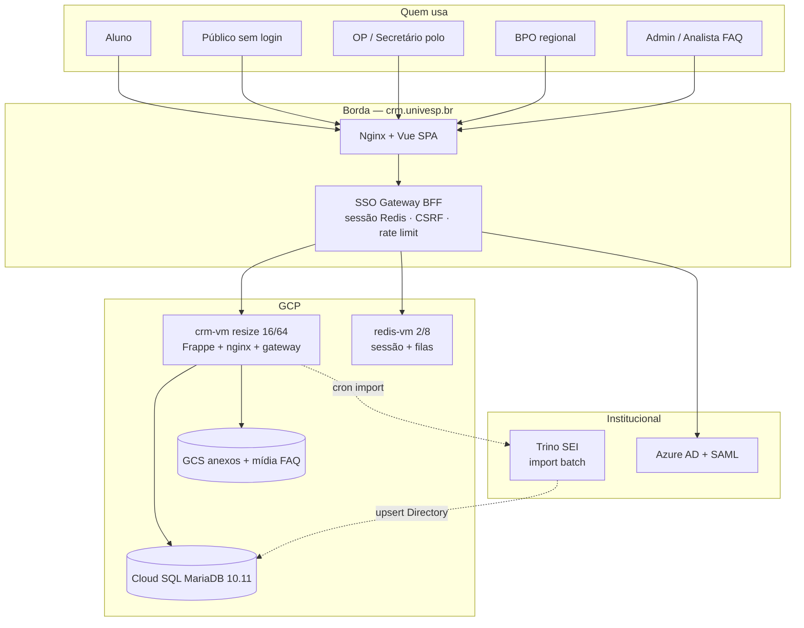
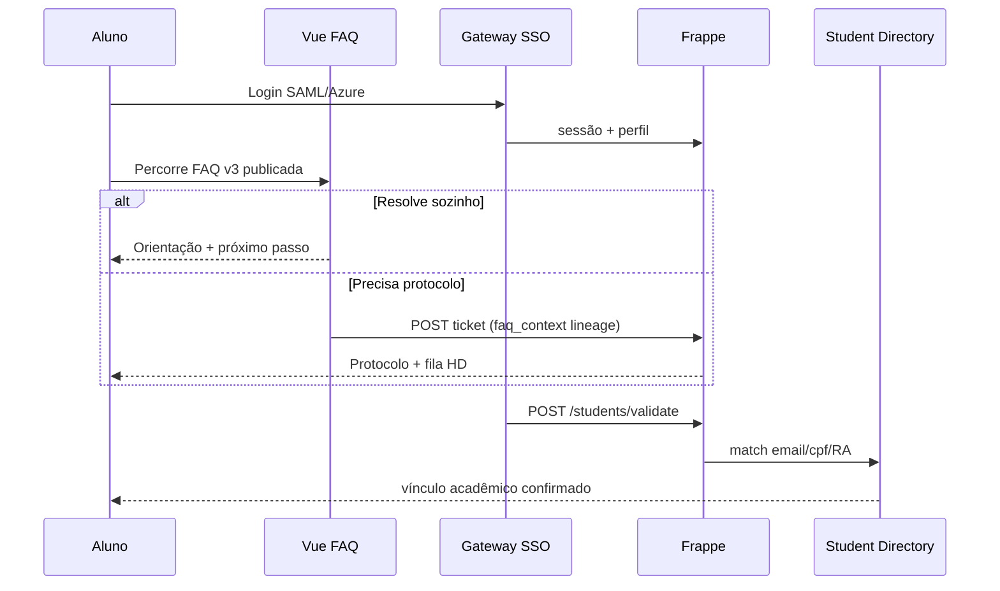
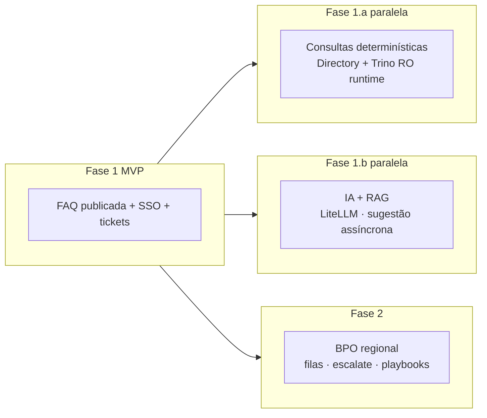
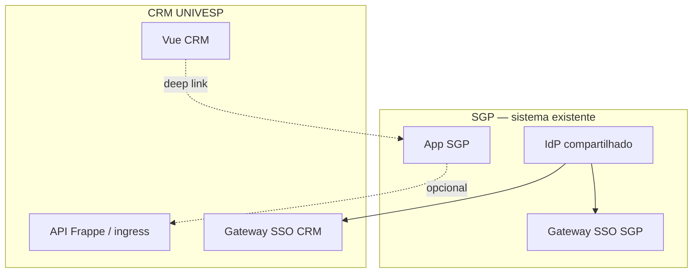
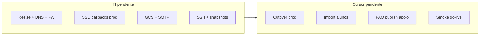

# Plano produção — CRM UNIVESP (upgrade in-place)

Documento único para **TI mínimo**, **Cursor/dev** e **roadmap de produto**.  
Referência técnica do que já existe no repo: `docs/MVP_CLOSURE_CHECKLIST.md`, `docs/SDD_CRM_UNIVESP.md`.

**Decisão (2026-08-04):** reutilizar **`crm-vm`** (Frappe 15 + MariaDB 10.11 + Redis). Caminho: resize → cutover prod → FAQ MVP → evoluções paralelas.

**Domínios (confirmado):**

| Ambiente | URL | Observação |
|----------|-----|------------|
| Produção | `crm.univesp.br` | novo cutover |
| Homolog | `homolog-crm.univesp.br` | **mantém como hoje** |

Branch deploy: `univesp/cloudrun-homolog`  
Repositório: `https://github.com/univesp/crm`

---

## Decisões confirmadas (2026-08-04)

| Tema | Decisão |
|------|---------|
| **Cadastro alunos** | Import **todos os polos** no Student Directory; operação piloto só em polos selecionados |
| **Usuários OP** | Directory e-mail+polo (espelho aluno); MVP manual via Access Profile |
| **Redis** | **VM dedicada desde o início** (2 vCPU / 8 GB) — pedir à TI agora |
| **Banco** | **Cloud SQL MariaDB 10.11** separado — pedir à TI agora; dev faz migração no cutover |
| **GCS** | Anexos de protocolo + mídia editorial FAQ (imagem/vídeo/GIF); FAQ só texto no MVP dispensa mídia pesada |
| **SMTP** | Relay só para **confirmação ao abrir protocolo**; sem thread reply-by-email no MVP |
| **Trino** | Conta técnica **`crm-import@...`** read-only — **não** usar conta pessoal |

---

## Já entregue (não repetir no plano operacional)

Stack aplicada no código e homolog VM (`crm.localhost`, migrate 23/07):

- Frappe 15 + Helpdesk + Telephony + `univesp_atendimento`
- Gateway SSO/BFF, FAQ v3 (editor, publish, playbooks OP/BPO/Analista no modelo)
- Tickets, anexos, omnichannel adapter, ingress assinado (`POST /api/ingress/v1/tickets`)
- Perfil `op_externo` (BPO), PWA, Student Directory + script Trino (conexão validada)
- Smoke/preflight scripts, seeds homolog, docs GCS/SSO

**O plano abaixo cobre só o que falta para produção e as fases seguintes.**

---

## Como o sistema funciona (visão geral)



### Fluxo principal (Fase 1 — MVP FAQ)



### Evoluções paralelas (pós-MVP FAQ)



---

## Roadmap de produto — faz sentido?

**Sim.** A ordem proposta equilibra risco e valor:

| Fase | Objetivo | Por quê nesta ordem |
|------|----------|---------------------|
| **1 — MVP FAQ** | Aluno/público resolve sozinho; protocolo só quando necessário | Menor superfície; prova SSO + publish + fila básica |
| **1.a — Dados** *(paralela)* | Respostas contextualizadas com situacao/curso/polo do banco | Determinístico, read-only, LGPD mais simples que LLM |
| **1.b — IA/RAG** *(paralela)* | Sugestão e busca semântica sobre FAQ + docs | Exige governança, workstation, curadoria; não bloqueia MVP |
| **2 — BPOs** | Operação regional escalonável com playbooks e filas | Código pronto; rollout é perfil + processo + treinamento |

**1.a e 1.b são paralelas** — podem começar após FAQ publicada, com equipes diferentes. **1.a** reduz chamados antes da IA; **1.b** amplia cobertura onde FAQ não chega.

**Fase 2 (BPO)** pode sobrepor parcialmente à 1.a/1.b (ex.: BPO já usa playbooks enquanto IA ainda é piloto).

---

## Fase 1 — MVP (FAQ funcionando)

**Critério de pronto:** aluno autenticado percorre FAQ **real** publicada; se não resolver, abre protocolo; OP vê fila; smoke verde; mocks off.

### TI (pendente) — pedido Fase 1 MVP

- [ ] Resize `crm-vm` → **16 vCPU / 64 GB**
- [ ] DNS **`crm.univesp.br`** + manter **`homolog-crm.univesp.br`** como hoje
- [ ] Firewall: 443 público; 8000/3306/6379 fechados; app → redis privado; app → Cloud SQL privado; app → Trino `:443`
- [ ] **VM Redis dedicada** — 2 vCPU / 8 GB, IP privado, porta 6379 só da `crm-vm`
- [ ] **Cloud SQL MariaDB 10.11** — instância dedicada, rede privada, credenciais no cofre
- [ ] Callbacks SSO prod (Azure + SAML) para `crm.univesp.br`
- [ ] GCS bucket prod + SA (anexos e mídia FAQ)
- [ ] Rede VM → Trino `:443`
- [ ] Conta Trino técnica read-only (`crm-import` ou similar) — **não** conta pessoal
- [ ] SSH dev + snapshot policy
- [ ] ~~SMTP completo~~ — relay só para **confirmação de protocolo** (1 e-mail/abertura); thread e-mail **off**

### Cursor/dev (pendente)

- [ ] Cutover: pull, migrate, gateway, nginx, frontend prod build
- [ ] Migrar MariaDB host → **Cloud SQL** (`db_host` bench + dump/restore)
- [ ] Reapontar Redis → **nova VM**
- [ ] `.env.vm` prod (IdP, Redis, GCS, Trino técnico)
- [ ] Import Trino **todos os polos** → Student Directory; filtrar operação só nos polos piloto
- [ ] Criar `Univesp Access Profile` por e-mail OP (escopo `polos: [237, ...]`) — piloto manual
- [ ] Validar SSO + `students/validate` nos dois domínios
- [ ] Workers + backup + smoke

### Produto / conteúdo (pendente)

- [ ] Publicar **10–15 temas FAQ** (texto ok; mídia GCS quando bucket pronto)
- [ ] Filas HD: `atendimento-geral`, `sra`
- [ ] OP piloto: perfis nos polos selecionados (lista abaixo)
- [ ] `faq_public_email_thread`: **off** | Knowledge Studio / IA: **off**

---

## Fase 1.a — Dados (paralela) — respostas mais precisas

**Objetivo:** enriquecer jornada FAQ e telas OP com **dados acadêmicos reais**, sem LLM.

| Entrega | Como |
|---------|------|
| Directory completo | Import Trino incremental (cron); filtros `situacao` ativa |
| Validação pós-SSO | `POST /students/validate` em produção |
| Resumo acadêmico | Substituir stub `academic_query.py` por serviço Trino RO **ou** views materializadas no MariaDB |
| FAQ contextual | Nós FAQ com regras por `situacao`, polo, curso (routing engine já suporta intents) |
| OP cockpit | Painel com RA, polo, curso, situação ao abrir ticket |

**Princípios:** read-only; cache TTL; nunca Trino síncrono no path crítico do aluno (timeout); PII só no Directory com hash CPF.

**TI:** manter rota Trino; opcional IP fixo para cron import.

---

## Fase 1.b — IA + RAG (paralela)

**Objetivo:** assistência sem substituir FAQ canônica nem publicar resposta automática ao aluno.

| Entrega | Como |
|---------|------|
| Sugestão pós-ticket | Job assíncrono (`enqueue_ai_suggestion`) — já stub no repo |
| RAG FAQ | LiteLLM na workstation; índice sobre bundles **publicados** + docs curados |
| Curadoria | SSH batch; **não** expor Knowledge Studio no T0 |
| Guardrails | Sem resposta direta ao aluno sem nó FAQ; confidence policy no builder |

**TI:** firewall workstation ↔ VM; sem expor LLM na internet.

**Depende de:** Fase 1 FAQ publicada (corpus RAG).

---

## Fase 2 — BPOs

**Objetivo:** operação regional com escopo limitado, playbooks BPO e escalonamento para fila interna.

| Entrega | Como |
|---------|------|
| Perfil `op_externo` | Azure/grupos + `Univesp Access Profile` |
| Escopo regional | `regional_pools` — só tickets dos polos autorizados |
| Playbooks | Camada BPO nos nós FAQ (herança OP ← já no modelo v3) |
| Escalonar | `POST /tickets/:id/escalate` → `waiting_internal` |
| Cockpit BPO | `BpoDashboardPage` + filas regionais |
| Privacidade | Matriz `docs/FAQ_V3_PRIVACY_OPERATIONS.md` (sem CPF/doc por padrão) |

**TI:** mesma infra Fase 1; possivelmente grupos IdP separados para `@externo`.

**Rollout:** piloto 1 região → expandir.

---

## Integração com o SGP — como pensar

O SGP já usa **mesmo padrão SSO** (gateway, `/api/me`, SAML/Azure). O CRM **não compartilha banco** com o SGP; integração por **contratos HTTP** e identidade comum.



### Padrões recomendados (do mais simples ao mais acoplado)

| # | Padrão | Uso | Esforço |
|---|--------|-----|---------|
| **A** | **SSO unificado** | Mesmo IdP, claims similares (email, grupos, polo) | Baixo — já é a direção do gateway |
| **B** | **Deep link com contexto** | SGP → `https://crm.univesp.br/crm/...?ra=&theme=` ou FAQ tema | Baixo |
| **C** | **Ingress assinado** | SGP abre protocolo no CRM: `POST /api/ingress/v1/tickets` + `X-Univesp-Ingress-Secret` | Médio — contrato em `docs/architecture/CHANNEL_ADAPTER_CONTRACT.md` |
| **D** | **Bridge leitura escopo** | CRM consulta SGP (modelo Presença `SGP_BRIDGE_URL`): polo/área do OP por e-mail | Médio — endpoint interno no SGP |
| **E** | **Bridge CRM → SGP** | SGP consulta CRM: status protocolo, último nó FAQ | Médio — novo endpoint read-only no CRM |
| **F** | **Eventos / fila** | Pub/Sub ou webhook quando ticket muda estado | Alto — fase posterior |

### Proposta pragmática T0 → T1

**T0 (Fase 1 MVP):** **A + B** — SSO mesmo IdP; link “Atendimento” no SGP aponta para FAQ CRM com `next=` pós-login.

**T1 (Fase 2 / 1.a):** **C + D** — SGP cria ticket no CRM quando fluxo presencial/SGP esgota; CRM valida OP via bridge polo (reutilizar ideia de `sgpBridge.js` do Presença).

**T1+:** **E** — widget “seu protocolo CRM” dentro do SGP (RA + protocolo number).

**Não fazer agora:** replicação de banco, SSO cookie compartilhado cross-domain, ou Trino compartilhado em runtime síncrono entre sistemas.

### Contrato ingress (SGP → CRM) — esboço

```json
POST /api/ingress/v1/tickets
Header: X-Univesp-Ingress-Secret: <shared>

{
  "channel": "portal",
  "source": "sgp",
  "student": { "ra": "...", "email": "...", "polo": "237" },
  "subject": "...",
  "description": "...",
  "faq_context": { "bundle_id": "...", "path": ["..."], "resolved": false },
  "queue": "atendimento-geral"
}
```

Secret compartilhado: mesmo mecanismo `UNIVESP_INGRESS_SHARED_SECRET` já no gateway.

---

## Infra de referência (pedido TI — Fase 1)

| Recurso | Spec | Pedir agora? |
|---------|------|--------------|
| `crm-vm` | 16 vCPU / 64 GB / ≥100 GB SSD | Sim |
| `redis-vm` | 2 vCPU / 8 GB, IP privado | **Sim** |
| Cloud SQL | MariaDB **10.11**, 4 vCPU / 16 GB, rede privada | **Sim** |
| GCS | Bucket privado + SA | Sim |
| Trino | Conta técnica RO | Sim |
| SMTP | — | **Não no MVP** |

Homolog permanece na VM atual / domínio atual até cutover prod estabilizar.

---

## Cadastro alunos × operadores OP (mesmo esquema de polo)

| Camada | Aluno | OP / secretário |
|--------|-------|-----------------|
| **Directory** | `Univesp Student Directory` (Trino, todos polos) | **Fase 1 MVP:** `Univesp Access Profile` manual · **Fase 1+:** `Staff Directory` (e-mail + `polo_id`) espelhando aluno |
| **Validação pós-SSO** | `POST /students/validate` | **Fase 1+:** `POST /operators/validate` (ou preencher escopo no 1º login) |
| **Escopo operacional** | — | `scopes_json: {"polos":["237"], "queues":["atendimento-geral"]}` — fila vê só tickets daquele polo |
| **AD / grupos Azure** | Automático via e-mail | Depois: grupo IdP → polo(s) no Directory |

**Hoje no código:** perfil `op` filtra por **fila** (`queues`); perfis `gestor_polos` / `op_externo` já filtram por **polo** (`custom_student_polo`). Para OP de polo, estender `op` com escopo `polos` ou usar Directory + perfil automático.

**Import OP (futuro):** mesma fonte Trino/SEI ou planilha institucional (e-mail institucional + código polo) — **não** misturar com Student Directory.

---

## SMTP — escopo mínimo Fase 1

| Evento | E-mail? | MVP |
|--------|---------|-----|
| Aluno só consulta FAQ | Não | — |
| Aluno logado **abre protocolo** | **Sim** — 1 confirmação (“protocolo X registrado; acompanhe no portal”) | Pedir relay TI |
| Thread reply-by-email (`faq_public_email_thread`) | Não | **Off** |
| Público sem login | Portal only (sem SMTP) ou confirmação opcional depois | Off no MVP |
| Notificações OP / gestor | Não | Portal + fila |

**Hoje:** e-mail só existe no fluxo **público** com `faq_public_email_thread=true`. Aluno autenticado **não** recebe e-mail ao abrir protocolo — patch pequeno no `tickets.create` para confirmação 1-way (sem `Reply-To`).

---

## Divisão TI × Cursor (só pendências)



---

## Checklist entrega TI → dev (Fase 1 MVP)

```text
[ ] crm-vm 16/64: ___
[ ] redis-vm IP privado: ___
[ ] Cloud SQL host + user + password: [cofre]
[ ] DNS crm.univesp.br: sim | homolog-crm.univesp.br inalterado: sim
[ ] SSO callbacks prod: sim/não
[ ] GCS bucket + SA JSON: [cofre]
[ ] Trino user técnico (crm-import): [cofre] — NÃO conta pessoal
[ ] Trino rede ok: sim/não
[ ] Polos piloto OP (operacao): _______________
[ ] SSH dev: sim/não
[ ] Janela go-live: ___
[ ] SMTP relay (confirmação protocolo only): ___
[ ] SMTP: thread reply-by-email = NÃO no MVP
```

---

## Critérios de aceite por fase

| Fase | Pronto quando |
|------|----------------|
| **1 MVP** | FAQ publicada + login real + protocolo + smoke verde + mocks off |
| **1.a** | `academic_summary` real + FAQ routing por situacao/polo (piloto) |
| **1.b** | Sugestão IA em ticket (piloto interno OP); RAG sobre FAQ publicada |
| **2 BPO** | 1 região operando com escalate + playbooks + matriz privacidade |

---

## Análise Trino — LDAP / AD / identidade (2026-08-04)

Consultas read-only via workstation (`univesp-data-knowledge` + Trino). **Não implantado no CRM.**

### Catálogos relevantes (37 no cluster)

| Catálogo | Schema | Tabelas principais | Status consulta | Uso CRM MVP |
|----------|--------|-------------------|-----------------|-------------|
| `postgresql-sei` | `public` | pessoa, matricula, funcionario, funcionariocargo… | **OK** | **Fonte oficial** aluno + OP/polo |
| `ad-acad` | `univesp` | users, groups, ous, computers, entries | **OK** (metadados) | **Não** — só 2 e-mails `@aluno.univesp.br` (AD acad incompleto) |
| `ad-adm` | `univesp` | idem AD | **Falha LDAP** (`ADMSRV-DC-002:636`) | **Não** — catálogo Trino instável |
| `ldap-openldap` | `ldap` | users, groups, ous… | **OK** (metadados) | **Não** — legado; SSO já cobre auth |
| `msgraph-acad` | `acad` | users (UPN, mail, dept, onprem…) | **OK** | **Opcional fase 2** — grupos Azure → perfil |
| `msgraph-adm` | — | — | não testado | Fase 2 |
| `postgresql-identidade` | — | — | **Catálogo quebrado** (DB inexistente) | Ignorar |
| `postgresql-identidade-prod` | public, keycloak, univesp… | public vazio | **OK** schema, sem tabelas úteis | Ignorar MVP |
| `postgresql-gestaousuarios` | — | — | **Auth failed** | TI corrigir catálogo se necessário depois |

### Contagens (agregadas, sem PII)

| Métrica | Valor | Fonte |
|---------|-------|-------|
| Alunos AT com e-mail `@aluno.univesp.br` | **~89.441** | SEI (`pessoaemailinstitucional` + matricula AT) |
| OP polo ativos (`@polo.univesp.br` + cargo ativo) | **425** e-mails distintos | SEI (`funcionario` + `funcionariocargo`) |
| Contas `@polo.univesp.br` no Graph acadêmico | **1.184** | `msgraph-acad` (superset: ex-funcionários, contas sem cargo SEI) |
| Alunos no AD acadêmico | **2** | `ad-acad` (não representa base real) |

### Conclusão LDAP/AD para o CRM

**O MVP não precisa importar LDAP/AD via Trino.**

| Camada | Como funciona no T0 |
|--------|---------------------|
| **Autenticação** | SSO gateway: Azure admin/acadêmico + SAML aluno — **TI configura IdP/callbacks** |
| **Perfil operacional** | `Univesp Access Profile` no Frappe (manual piloto → sync Staff Directory) |
| **Vínculo acadêmico aluno** | `Univesp Student Directory` ← import batch **SEI** |
| **Escopo polo OP** | `Univesp Staff Directory` ← import batch **SEI** (`funcionariocargo`) |

LDAP/AD/Graph ficam para **fase 2+** (ex.: mapear `memberof`/grupos Azure → `profile_key` automaticamente). Problemas nos catálogos `ad-adm` e `gestaousuarios` são **dívida de infra Trino**, não bloqueiam homolog se usarmos SEI + SSO.

---

## Sync SEI — guardado para implantar depois

Código pronto **localmente** (ainda não commitado/deployado na VM):

- `ops/import/students-from-trino.py`, `staff-from-trino.py`, `sync-sei-directories.sh`
- DocTypes `Univesp Staff Directory` + lógica `import_staff.py`
- Docs: `docs/crm-sei-daily-sync.md`, `docs/crm-import-staff-directory.md`

**Quando autorizar deploy:** `bench migrate` → `.env.trino` com conta `crm-import` → dry-run full → `--apply` → cron 03:15 UTC.

---

## GitHub — projetos verificados

| Repo | Papel | Estado |
|------|-------|--------|
| [univesp/crm](https://github.com/univesp/crm) | CRM + gateway + FAQ v3 + ops | Branch deploy: `univesp/cloudrun-homolog` |
| [univesp/univesp_presenca](https://github.com/univesp/univesp_presenca) | Referência SSO + `sgpBridge` | Integração T1 SGP |
| [univesp/SGP](https://github.com/univesp/SGP) | Painel estágios | Deep link / ingress T0 |
| [univesp/acesso_unico](https://github.com/univesp/acesso_unico) | Portal acesso (estático) | Sem integração CRM direta |
| [univesp/sga-services](https://github.com/univesp/sga-services) | LDAP legado Ruby (2018) | **Não usar** — substituído por gateway |

**PRs abertos relevantes:** #20 (kit homolog TI, draft), #21 (simulador UX), #39 (FAQ v3 escopos/prazo).

**Cloud Run homolog** (alternativa à VM): bloqueado por 4 papéis IAM na SA de deploy + admin Environment GitHub — ver `docs/TI_HOMOLOGACAO.md`. Caminho **VM** (`crm-vm`) é o acordado para prod; homolog pode continuar na VM atual.

---

## O que já verificamos (dev) — não pedir de novo à TI

- [x] Trino acessível; catálogo `"postgresql-sei"` com aspas
- [x] Queries aluno (89k AT) e OP polo (425) validadas
- [x] Código import SEI + Staff Directory + filtro `op` por polo
- [x] Gateway SSO, FAQ v3, tickets, ingress, PWA, smoke scripts no repo
- [x] VM baseline jul/2026 documentada (`ops/vm/HANDOFF_TI.md`)
- [x] msgraph-acad consultável (fase 2 grupos)
- [x] AD/LDAP mapeado — **decisão: não usar no MVP**

---

## Checklist TI → dev — homolog real (primeiro)

Pedido mínimo para **`homolog-crm.univesp.br`** com SSO real:

```text
[ ] SSH dev na crm-vm (usuário + chave): ___
[ ] Callbacks SSO homolog (Azure admin + acadêmico + SAML):
      https://homolog-crm.univesp.br/api/sso/azure/callback
      https://homolog-crm.univesp.br/api/sso/saml/callback
[ ] Secrets IdP no cofre (client secrets, cert SAML) — dev monta .env.vm
[ ] 4 contas sintéticas IdP: aluno | OP | analista_area | admin (MFA, owner)
[ ] Rede crm-vm → trino.univesp.br:443 (testar da VM, não só workstation)
[ ] Conta Trino técnica crm-import (RO) — credenciais no cofre
[ ] Redis homolog acessível da VM (IP: ___)
[ ] Polos piloto operação: _______________
[ ] Janela smoke assistido: ___
```

**Dev faz após receber acima:** pull branch, migrate, `.env.vm`, deploy frontdoor, import SEI (quando código mergeado), FAQ publish, smoke `ops/smoke/mvp-e2e.ps1`.

---

## Checklist TI → dev — produção (depois homolog verde)

```text
[ ] crm-vm resize 16 vCPU / 64 GB
[ ] redis-vm 2/8 IP privado: ___
[ ] Cloud SQL MariaDB 10.11 host + credenciais: [cofre]
[ ] DNS crm.univesp.br → crm-vm (homolog inalterado)
[ ] Firewall: 443 público; 8000/3306/6379 privados
[ ] SSO callbacks prod (mesmos paths, domínio crm.univesp.br)
[ ] GCS bucket + SA JSON anexos/FAQ: [cofre]
[ ] Trino crm-import + rede VM→443: sim
[ ] SMTP relay (só confirmação protocolo — opcional MVP portal-only)
[ ] Snapshots VM + janela go-live: ___
```

**Dev faz:** cutover MariaDB→Cloud SQL, Redis→VM dedicada, import full SEI, perfis OP piloto, smoke go-live.

---

## O que a TI **não** precisa fazer para o MVP

- Importar LDAP/AD para o CRM
- Corrigir catálogo `ad-adm` no Trino (salvo uso futuro Graph/grupos)
- Cloud Run (se mantivermos VM como caminho principal)
- SMTP thread reply-by-email
- IA/RAG, LiteLLM exposto, Knowledge Studio público
- 474 filas HD Teams por polo

---

*Atualizado: 2026-08-04 — análise LDAP/AD Trino, contagens SEI, sync SEI guardado, checklists homolog→prod.*
